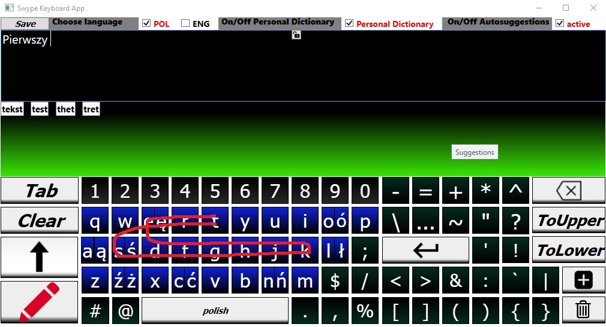

# Virtual-Keyboard-SWYPE-method-
Projekt dotyczy klawiatury ekranowej, w której można pisać przy pomocy rysowania ciągłej linii (metoda SWYPE) w systemie Windows.

## Ogólne informacje
Projekt dotyczy klawiatury ekranowej, w której można pisać przy pomocy rysowania ciągłej linii (metoda SWYPE). 
Pisanie możliwe jest w dwóch językach: polskim i angielskim. Aplikacja korzysta ze słowników. 
Klawiaturę można wykorzystać we wszystkich aplikacjach systemu Windows. 
Oprócz pisania standardowego, polegającego na pojedynczym wprowadzaniu liter, istnieje możliwość wstawiana pełnych słów poprzez rysowanie ścieżki znaków. 
Wystarczy, że użytkownik będzie przesuwał wskaźnik myszy po literach zawartych w słowie, zaczynając od kliknięcia lewego przycisku myszy w pierwszą literę szukanego słowa, 
i puści przycisk, gdy dotrze do ostatniej litery. Aplikacja wyświetla proponowane słowa w panelu sugestii. Wstawienie słowa odbywa się poprzez najechanie na niego lub kliknięcie. 
Istnieje możliwość tworzenia osobistego słownika. 

## Technologie
* C#
* WPF
* XAML
* Windows Input Simulator

